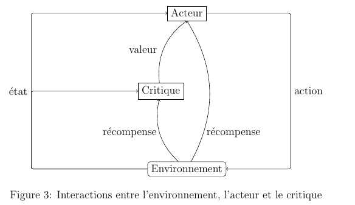
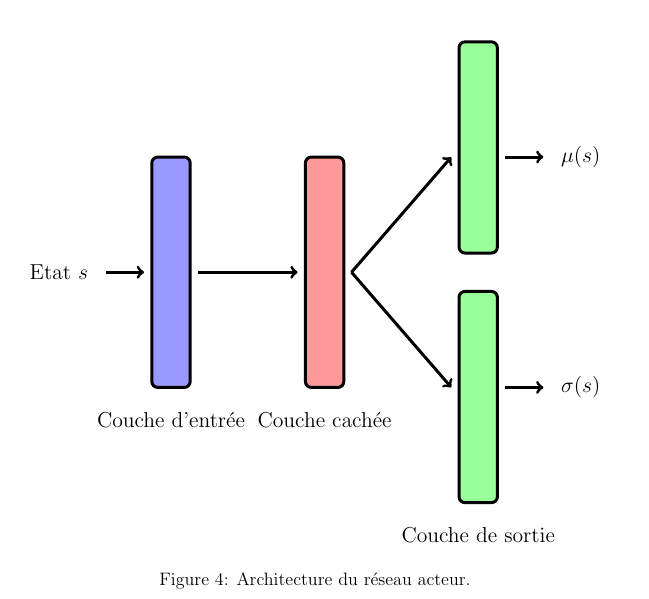
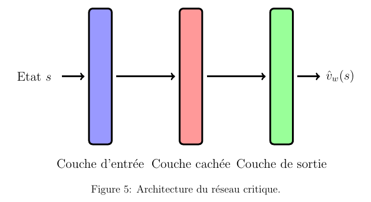

Algorithmes d'apprentissage par renforcement utilisés
=====================================================

La modélisation décrite dans la section [modélisation](modelisation.md) est implémentée dans le fichier
*environment.py* du sous-package *reinforcement\_learning*.
L'inconvénient de cette modélisation est que le nombre d'actions qui
peuvent être choisies pour un état donné est énorme : $N^3$. En
pratique, le nombre de liaisons $N$ peut être de l'ordre de $100$ soit
$1 000 000$ d'actions possibles pour chaque état. Cela rend les
approches de type *deep Q-learning* inutilisables car elles font
justement l'hypothèse que l'espace des actions est de petite taille.
Nous avons décidé d'utiliser plutôt des approches de type
acteur-critique qui s'affranchissent de cette limitation.

Acteur-critique
---------------

L'algorithme utilise deux réseaux de neurones : un réseau qui choisit
une action à partir d'un état et un autre qui juge la qualité de
l'action choisie. Le premier est appelé l'acteur et le second le
critique. On note $\theta$ le vecteur de paramètres de l'acteur et $w$
le vecteur de paramètres du critique. Voici les étapes de l'algorithme :

-   Le réseau acteur choisit une action.

-   L'action est prise et a une conséquence sur l'environnement

-   L'acteur et le critique reçoivent une récompense et le nouvel état
    de l'environnement.

-   Les vecteurs de poids $\theta$ et $w$ sont mis à jour en
    conséquence.

-   Les quatre dernières étapes sont répétées jusqu'à la convergence de
    la somme cumulée des récompenses.

La figure [3](#fig3)
illustre les interactions entre l'environnement, l'acteur et le
critique. Détaillons les différentes étapes.

La figure [4](#fig4)
montre l'architecture du réseau acteur. Son rôle est de choisir une
action à partir d'un état $s$ de l'environnement. Le réseau de neurones
retourne deux vecteurs : un vecteur de 3 réels $\mu(s)$ et un vecteur de
3 nombres positifs $\sigma(s)$. L'action choisie par l'acteur est une
action choisie aléatoirement selon la loi normale
$\mathcal{N}(\mu(s), \text{diag}(\sigma(s)))$ (où
$\text{diag}(\sigma(s))$ est la matrice diagonale contenant les
coefficients de $\sigma(s)$ ). On remarque que la distribution est
continue alors que l'environnement est discret. En effet, le nombre
d'actions à considérer pour chaque est état est de l'ordre de $N^3$. Le
choix d'une distribution de probabilité discrète nécessiterait $N^3$
neurones de sortie dans le réseau ce qui rendrait son entraînement
difficile. Le choix d'une loi normale réduit le nombre de sorties à 6.
Cette astuce s'appelle l'astuce de la reparamétrisation et est beaucoup
utilisée en apprentissage profond. Les couches utilisées dans le réseau
acteur sont des couches denses.

La figure [5](#fig5)
représente l'architecture du réseau critique. Son rôle consiste à
retourner une valeur $\hat{v}_w(s)$ à partir d'un état $s$ de
l'environnement. Cette valeur sert par la suite à quantifier la qualité
d'une action choisie par l'acteur. De même que pour l'acteur, les
couches utilisées dans le réseau critique sont denses.

Les poids des réseaux sont mises à jour par un algorithme de
rétropopagation du gradient. La fonction de coût à minimiser pour le
critique (pour tout $s \in \mathcal{S}$ et pour tout $a \in \mathcal{A}$)
est :

$$L_{critique}(\theta, w, s,a) = \frac{1}{2}\left(r(s,a) + \gamma\hat{v}_w(T(s,a)) - \hat{v}_w(s)\right)^2$$

où $\gamma$ est la facteur d'atténuation des récompenses futurs. C'est
un des hyperparamètres de l'algorithme. Sa valeur est fixée à $0.99$. La
fonction de coût de l'acteur (pour tout $s \in \mathcal{S}$ et pour tout
$a \in \mathcal{S}$) est :

$$L_{acteur}(\theta, w, s,a) = -\log(\pi_\theta(a|s))L_{critique}(\theta, w, s,a)$$

où $\pi_\theta(.|s)$ est la densité de la distribution de probabilité
des actions retournée par l'acteur. Les poids sont mis à jour de la
façon suivante :

$$\begin{aligned}
    \theta &\leftarrow  \theta - \alpha_\theta \nabla_\theta L_{acteur}\left(\theta, w,s,a\right) \\
    w & \leftarrow w - \alpha_w \nabla_{w}L_{critique}\left(\theta, w,s,a\right)\end{aligned}$$

où $\alpha_\theta$ et $\alpha_w$ sont respectivement les taux
d'apprentissage de l'acteur et du critique. Ces hyperparamètres
contrôlent la vitesse d'apprentissage des réseaux. Ils sont fixés à une
petite valeur de $10^{-4}$ pour stabiliser l'entraînement des deux
réseaux.
