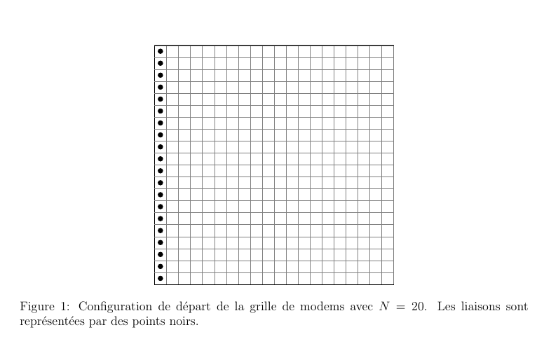
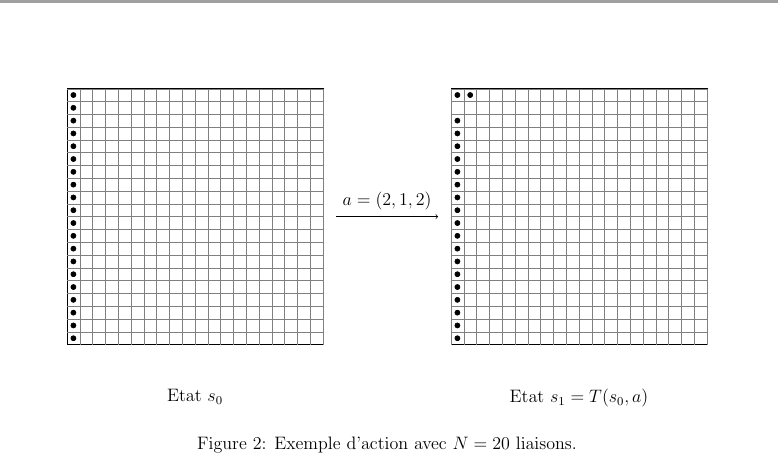

Modélisation du problème
========================

Modélisation générale
---------------------

On s'intéresse à un ensemble de $N$ liaisons satellite noté
$\mathcal{L}=\\{l_1, ..., l_N\\}$. L'objectif est d'affecter ces liaisons à des
modems eux-mêmes répartis dans des groupes de modems. On fait
l'hypothèse que l'on dispose d'un nombre infini de modems identiques et
on veut minimiser le nombre de groupes et de modems utilisés tout en
respectant certaines contraintes décrites plus loin.

On suppose que les modems sont répartis sur une grille à deux dimensions
infinie. On note $\mathcal{M}$ l'ensemble des modems. Cet ensemble est en
bijection avec $\mathbb{N}^2$. Soit $m_{ij}$ un modem de $\mathcal{M}$,
$m_{ij}$ est le j-ième modem du i-ième groupe. Formellement:

$$\mathcal{M} = \\{m_{ij}, i \in \mathbb{N}^*, j \in \mathbb{N}\\}$$

L'objectif décrit précédemment revient à construire une application
$\phi :  \mathcal{L} \rightarrow \mathcal{M}$ tel que l'ensemble image $\phi(\mathcal{L})$
soit de cardinal minimal. Une solution triviale est la suivante: on
prend l'application $\phi$ telle que :

$$\forall i \in \\{1,...,N \\}, \phi_0(l_i) = m_{i1}$$

Comme on cherche une application avec le cardinal de l'ensemble image le
plus petit possible, on peut restreindre l'ensemble d'arrivée de $\phi$
à $\\{m_{ij},  (i,j) \in \{1,...,N\}^2 \\}$.

Mise sous forme d'un problème de programmation linéaire
-------------------------------------------------------

### Notations

Caractéristiques d'une liaison :

-   $q_{S}$ : débit symbole

-   $q_{B}$ : débit binaire

-   $q_{BI}$ : débit binaire inverse demandé

-   $Q_{BI}$ : débit binaire inverse maximal

-   $b$ : bande passante

Caractéristiques d'un modem :

-   Nombre de liaisons maximal $N_m$ : 4

-   Débit binaire maximal $Q_{B}$

-   Débit symbole maximal $Q_{S}$

Caractéristiques d'un groupe :

-   Nombre de liaisons maximal $N_g$ : 31

-   Bande passante maximale $B_G$

### Variables de décision

Les variables de décision sont :

-   un tenseur $X$ de dimensions $(N,N,N)$ tel que $X_{ijk}$ vaut 1 si
    la liaison i est placée dans le modem k du groupe j et 0 sinon.

### Contraintes

Contraintes sur les modems :

-   Chaque modem ne doit pas contenir plus de $N_m$ liaisons :
    $$\forall j \in \\{1,...,N\\}, \forall k \in \\{1,...,N\\} \sum_{i=1}^N X_{ijk}\leq N_m$$

-   La somme des débits binaires des liaisons d'un même modem ne doit
    pas excéder $Q_B$:
    $$\forall j \in \\{1,...,N\\}, \forall k \in \\{1,...,N\\}, \sum_{i=1}^N q_B[i]X_{ijk} \leq Q_B$$

-   La somme des débits symbole des liaisons d'un même modem ne doit pas
    dépasser $Q_S$:
    $$\forall j \in \\{1,...,N\\}, \forall k \in \\{1,...,N\\}, \sum_{i=1}^Nq_S[i]X_{ijk} \leq Q_S$$

Contraintes sur les groupes :

-   Chaque groupe ne doit pas contenir plus de $N_g$ liaisons :
    $$\forall j \in \\{1,..., N\\}, \forall k \in \\{1,...,N\\}, \sum_{i=1}^N X_{ijk} \leq N_g$$

-   La somme des bandes passantes des liaisons d'un même groupe ne doit
    pas dépasser la bande passante maximale $B_G$:
    $$\forall j \in \\{1,...,N\\}, \forall k \in \\{1,...,N\\}, \sum_{i=1}^N b[i]X_{ijk} \leq B_G$$

-   La somme des débits inverses doit être inférieure au minimum des
    débits inverses maximaux des liaisons présentes dans le groupe :
    $$\forall l \in \\{1,...,N\\}, \forall j \in \\{1, ..., N\\}, \sum_{i=1}^N\sum_{k=1}^Nq_{BI}[i]X_{ijk} \leq \sum_{k=1}^NQ_{BI}[l]X_{ljk}$$

### Objectif

L'objectif est de minimiser le nombre de modems et de groupes utilisés.
La fonction objectif à minimiser est:

$$\sum_{i=1}^N \sum_{i=1}^N \sum_{j=1}^N X_{ijk}$$

Adaptation de la modélisation à l'apprentissage par renforcement.
-----------------------------------------------------------------

Suite à une revue des solutions existantes, nous avons décidé d'utiliser
de l'apprentissage par renforcement afin de résoudre le problème
d'optimisation. Il s'appuie sur la notion de processus de décision
Markov. Les algorithmes d'apprentissage par renforcement requièrent que
notre problème soit mis sous la forme d'un processus de décision
markovien. En effet, dans l'apprentissage par renforcement, un agent
interagit avec un environnement modélisé par ce type de processus.

### Définition d'un processus de décision markovien

On travaille toujours sous l'hypothèse que l'ensemble d'arrivée de
$\phi$ est $\mathcal{M}_N$. Cela signifie que l'on répartit les modems
sur une grille carrée de taille $N^2$. Formellement, un processus de
décision markovien est défini par un quadruplet
$(\mathcal{S}, \mathcal{A}, T, r)$ :

-   $\mathcal{S}$ : l'ensemble des états

-   $\mathcal{A}$ : l'ensemble des actions

-   $T : \mathcal{S} \times \mathcal{A} \rightarrow \mathcal{S}$ une fonction
    de transition.

-   $r : \mathcal{S} \times \mathcal{A} \rightarrow \mathbb{R}$ une
    fonction de récompense.

Mise sous forme d'un processus de décision markovien
----------------------------------------------------

Dans notre cas, l'environnement correspond à la grille bidimensionnelle
sur laquelle les liaisons sont positionnées. L'état de la grille
correspond à l'ensemble image
$\phi_0(\mathcal{L}) = \{m_{i1}, \forall i \in \{1,...,N\}\}$.

Dans ce cas, le processus de décision markovien est défini par:

-   $\mathcal{S} = \\{B \subset \\{1,...,N\\}^2, \left|B\right| = N\\}$,
    l'ensemble des états qui correspond aux parties de $\\{1,...,N\\}^2$
    de cardinal $N$. Un état est la liste des $N$ coordonnées des
    liaisons sur la grille.

-   $\mathcal{A} = \\{1,..,N\\}^3$, l'ensemble des actions. Une action est
    définie par un triplet $(i,j,k) \in \\{1,...,N\\}^3$ car on choisit
    une liaison $i$ qui est affectée au modem $(j, k)$.

-   La fonction de transition $T$ est la fonction qui à un état $s$ et
    une action $a = (i,j,k)$ retourne l'état $s'$ où les coordonnées de
    la liaison $i$ sont $(j,k)$ si ce déplacement respecte les
    contraintes du problème. Sinon l'état $s$ reste inchangé.

-   Pour définir la fonction de récompense, on note pour un état
    $s\in \mathcal{S}$, $u(s)$ le nombre de modems et $g(s)$ le nombre de
    groupes utilisés dans cet état. Un modem ou un groupe est utilisé à
    partir du moment où il contient une liaison. On définit d'abord la
    fonction différence
    $\Delta :  \mathcal{S} \times \mathcal{A} \rightarrow \mathcal{A}$ par:
    $$\Delta (s,a) = \left(u(T(s,a)) + g(T(s,a)) - u(s) - g(s)\right)$$

    La fonction $\Delta$ calcule la différence entre la somme du nombre
    de modems et du nombre de groupes à l'état successeur de $s$ par
    l'action $a$ et à l'état $s$. La fonction de récompense est définie
    par: 
    
    - $$r(s,a) = 10\Delta(s,a)\frac{N}{\sqrt{u(T(s,a))g(T(s,a))}} \text{si } \Delta(s,a) > 0 $$
    - $$r(s,a) = -\frac{\sqrt{u(T(s,a))g(T(s,a))}}{N} \text{si } \Delta(s,a) = 0 $$
    - $$r(s,a) =  -\Delta(s,a)\frac{\sqrt{u(T(s,a))g(T(s,a))}}{N}  \text{si } \Delta(s,a) < 0$$

Illustrons avec un exemple.

Dans l'exemple de la figure [2](#fig2), l'état de départ $s_0$ de la grille est:

$$s_0 = \begin{pmatrix}
    1 & 1 \\
    2 & 1 \\
    3& 1 \\
    \ldots & \ldots \\
    20 & 1 
\end{pmatrix}$$

On affecte la liaison $l_2$ au deuxième modem du premier groupe. Cela
correspond à l'action $a = (2,1,2)$. L'état de la grille après cette
action est :

$$s_1 = \begin{pmatrix}
    1 & 1 \\
    1 & 2 \\
    3 & 1 \\
    \ldots & \ldots \\
    20 & 1 \\
\end{pmatrix}$$ 

Calculons $\Delta(s_0, a)$. Dans l'état $s_0$, on compte
$u(s_0) = 20$ modems et $g(s_0) = 20$ groupes. Dans l'état $s_1$, on
dénombre $u(s_1) = 20$ modems et $g(s_1) = 19$ groupes. Ainsi,

$$\Delta(s_0, a)  = u(s_1) + g(s_1) - u(s_0) - g(s_0) = -1$$

La récompense observée pour cette action est alors de :
$$r(s_0, a) = -10 \Delta(s_0,a)\frac{N}{\sqrt{u(s_1)g(s_1)}}=\frac{200}{\sqrt{380}} \approx 10.26$$
